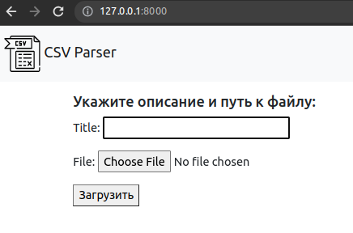

# csv parser


## Task

* Создать проект на Django.
* Создать модель с полями охватывающими столбцы из CSV файла.
* Создать страницу с формой, в которую будет загружаться CSV файл.
* Создать View, которая будет парсить этот файл в созданную модель.
* Вывести на отдельную страницу список выгруженных данных.

## How to use
* Начальный экран

* Необходимо ввести описание файла, и путь к файлу, нажать кнопку "Загрзить"

* Сообщение об успешной загрузке файла, и получение формы для парсинга по полям загруженного .csv файла

* Выгрузка из .csv по заданному значению


* Сообщение об успешной загрузке

* Данные из парсинга сохраняются в БД SQLite

* Так же загружаемые фалы .csv сохраняются в БД

## Tech Stack

The project is currently running on the following versions:

Backend:
* Python 3.10
* Django 4.1.3
* Pandas 1.5.2
* SQLAlchemy 1.4.44

Frontend:
* Bootstrap 5.2.2

## Running Locally

To run the project locally first you need to clone the repository:
```
git clone https://github.com/MrRom4ke/csv_parser.git
```
Create a virtualenv:
```
virtualenv venv -p python3
```
Install the development requirements:
```
pip install -r requirements.txt
```
Run the local server:
```
python3 manage.py runserver
```
## License
The source code is released under the [MIT License](https://github.com/vitorfs/parsifal/blob/master/LICENSE).
## Author
MrRom4ke
